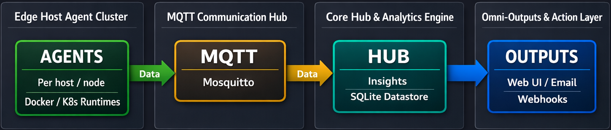

# Insightd

**Server awareness without the overhead.** A self-hosted monitoring tool for homelabbers that watches your Docker containers, hosts, and HTTP endpoints across multiple servers — with a modern web dashboard, smart alerts, and weekly digests.

```
Insightd — Week 14

Uptime:       99.8%  (Vaultwarden down 2h Tuesday)
Updates:      3 containers have new versions available
Resources:    Postgres using 20% more RAM than last week
Restarts:     2  (Nginx, Redis)
Health Score: 92/100

No critical issues. Good week.
```

## Features

- **Multi-host, multi-runtime monitoring** — deploy agents on each server reporting to a central hub via MQTT. Docker and Kubernetes/k3s (DaemonSet mode) are both first-class.
- **Research-grounded diagnosis engine** — when a container is unhealthy, seven signal detectors fuse metrics, robust baselines, restart history, host state, and Drain-mined log patterns into a ranked explanation with correlated upstream services via Personalized PageRank. Based on Drain (ICWS 2017), MicroRCA (NOMS 2020), and Adtributor (NSDI 2014).
- **Smart alerts with calibrated confidence** — 10 alert types with cooldowns, exponential reminder backoff, per-alert silencing, and webhook delivery (Slack, Discord, Telegram, ntfy, generic). Thumbs-up/down feedback on diagnosis cards recalibrates future confidence via a Beta posterior.
- **Insights & anomaly detection** — time-of-day baselines, predictive alerts, trend detection, and Seasonal-Hybrid ESD on hourly rollups. A dedicated `/insights` page surfaces analytical signals separate from operational "Needs Attention" alerts.
- **Modern web dashboard** — React UI with health score, uptime timelines, per-container charts, host grouping, stacks (auto-detected from Docker Compose), public status page, keyboard shortcuts, and a setup wizard that means no `.env` file is required.

## Quick Start

### Single Server (Standalone Mode)

The fastest way to get started. One container, no MQTT needed.

```bash
docker run -d \
  --name insightd \
  --restart unless-stopped \
  -v /var/run/docker.sock:/var/run/docker.sock:ro \
  -v /:/host:ro \
  -v insightd-data:/data \
  -p 3000:3000 \
  andreas404/insightd-hub:latest
```

Open **http://your-server:3000** and follow the **Setup Wizard** — it walks you through setting a password, configuring email, and adding agents.

### Multi-Server (Docker Compose)

For monitoring multiple servers, insightd uses MQTT to connect lightweight agents to a central hub. See the [Docker Compose setup guide](https://docs.insightd.org/guides/docker-compose/) for the full walkthrough (Mosquitto config, `.env`, `docker-compose.yml`, and adding remote agents).

### Kubernetes / k3s

Run the agent as a DaemonSet — one pod per node, each reports its node as a host. See the [Kubernetes guide](https://docs.insightd.org/guides/kubernetes/) for the full setup.

## Web UI

The hub serves a dashboard at `http://localhost:3000`. See [insightd.org](https://insightd.org) for screenshots of the dashboard, container detail, host detail, and insights pages.

## Architecture



- **Agent** — collects Docker and host metrics, publishes to MQTT, handles log requests, container actions, and remote updates
- **Hub** — subscribes to MQTT, stores in SQLite, serves the React UI, runs the insights engine, sends alerts and digests
- **Standalone mode** — hub without MQTT runs collectors locally (single-host)
- **Mosquitto** — MQTT broker in a separate container (stays up during hub/agent updates)

## Configuration

All configuration can be done via the **Setup Wizard** and **Settings page** in the web UI after the hub is deployed — no `.env` file required. Most settings are hot-reloadable and take effect without a restart. Environment variables are also supported; see the [full configuration reference](https://docs.insightd.org/reference/config/) for every variable.

### Key variables

| Variable | Default | Description |
|----------|---------|-------------|
| `INSIGHTD_MQTT_URL` | — | MQTT broker URL (enables hub mode) |
| `INSIGHTD_HOST_ID` | `local` | Identifies this host in multi-host setups |
| `INSIGHTD_HOST_GROUP` | — | Optional logical group label for the Hosts page |
| `INSIGHTD_RUNTIME` | `auto` | Container runtime: `auto`, `docker`, or `kubernetes` |
| `INSIGHTD_ADMIN_PASSWORD` | — | Admin password for the web UI |
| `INSIGHTD_ALLOW_ACTIONS` | `false` | Enable container start/stop/restart from UI (Docker only) |
| `INSIGHTD_ALLOW_UPDATES` | `false` | Enable remote agent updates from hub (Docker only) |
| `INSIGHTD_STATUS_PAGE` | `false` | Enable public status page at `/status` |
| `GEMINI_API_KEY` | — | Enables the "Diagnose with AI" button on container detail |
| `TZ` | `UTC` | Timezone for cron schedules |

Everything else — SMTP, alert thresholds, retention, webhooks, AI diagnosis model, digest schedule — can be tweaked from the Settings page inside the hub after it's deployed.

## Docker Images

Available on Docker Hub as multi-arch images (amd64 + arm64):

- [`andreas404/insightd-hub`](https://hub.docker.com/r/andreas404/insightd-hub)
- [`andreas404/insightd-agent`](https://hub.docker.com/r/andreas404/insightd-agent)

## Resource Usage

Insightd is designed to be lightweight. Typical footprint on a homelab with ~10 hosts:

- **Hub**: ~180 MB RAM
- **Agent**: ~40 MB RAM per host
- **Mosquitto**: ~10 MB RAM
- **SQLite** for storage — no external database needed
- Raw snapshots auto-pruned after 30 days (configurable), with hourly rollups kept for 365 days for long-term trends

## Security

See [SECURITY.md](SECURITY.md) for vulnerability reporting.

## License

MIT
