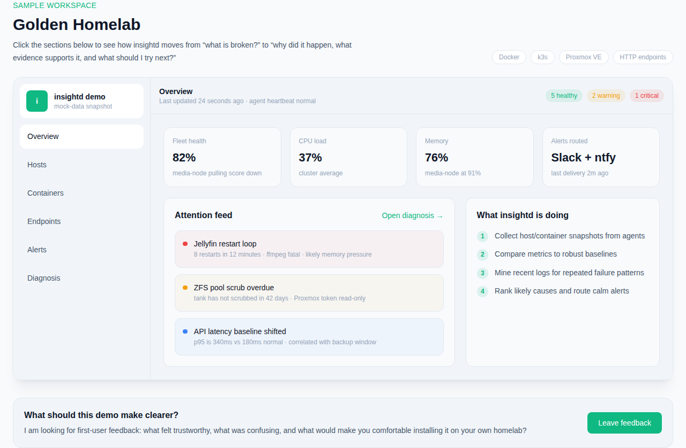
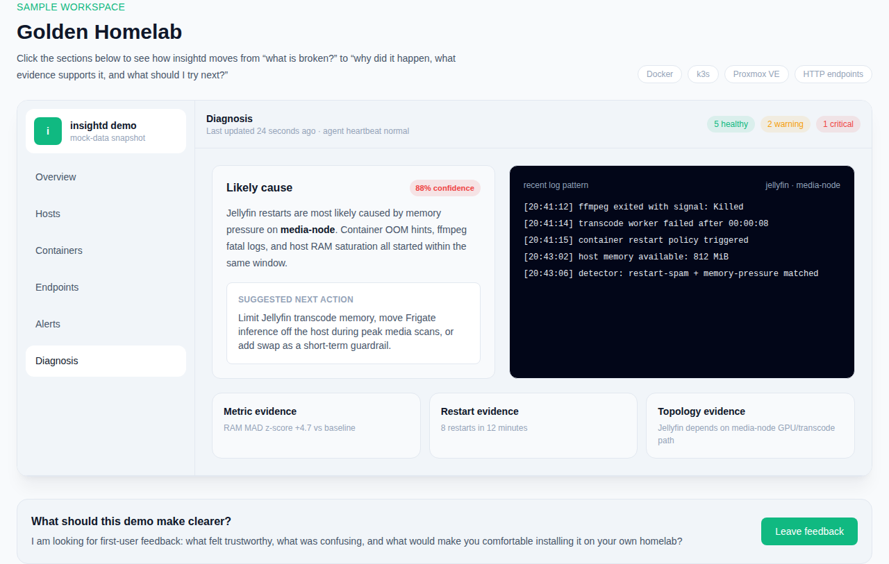
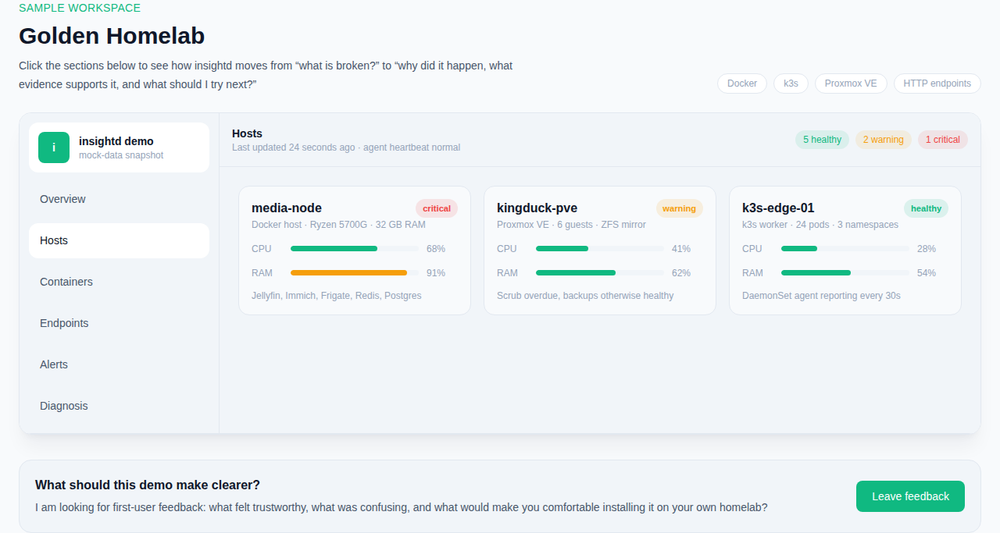
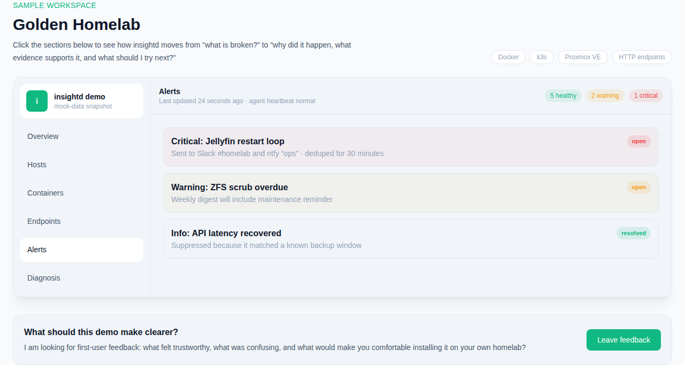
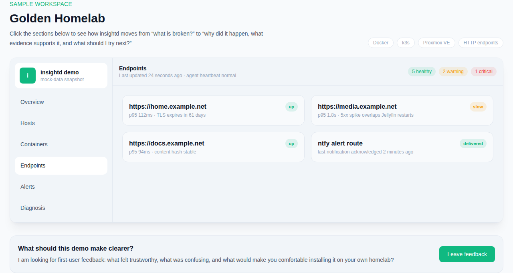

# Insightd

**Server awareness without the overhead.** A self-hosted monitoring tool for self-hosters that watches your containers, hosts, and HTTP endpoints across Docker, Kubernetes, and Proxmox VE — and tells you *why* something broke, not just *what*.

Most self-hosted monitors cover one runtime. Insightd treats Docker containers, Kubernetes pods (with full namespace topology and workload health), and Proxmox LXC/QEMU guests (with ZFS, backups, and quorum) as first-class citizens in the same UI. When a container goes unhealthy, it correlates metrics, restart history, host state, and log patterns into a ranked explanation — so you spend less time digging. Calm alerts by default (capacity thresholds, not 1.4% baseline noise), modern web dashboard, email + webhook delivery. Privacy-first, SQLite-backed, one-command Docker install.

> **Status: early adopter phase (v0.24).** Core features are stable and used daily on a multi-host homelab; the API and schema are still evolving toward 1.0.

See [insightd.org](https://insightd.org) for screenshots and the dashboard tour. Below is the kind of output you get on a real incident — a Jellyfin container that started respawning ffmpeg during a transcode:

```
jellyfin (unhealthy 4m)  ──  host: media-01
──────────────────────────────────────────────
Likely cause: ffmpeg respawn loop
  · 318 ffmpeg processes spawned in 15min, avg lifetime 380ms
  · Pattern match: media_file_corrupted (movie.mkv at 48:30)
  · Host load 8.2 (24h baseline 1.1)
Suggested: verify movie.mkv integrity, then restart transcode worker
Confidence: high (3 signals agree)
```

## Try it

- [Interactive demo](https://insightd.org/demo/) — click through a realistic sample homelab before installing
- [Quick Start guide](https://docs.insightd.org/guides/quick-start/) — full Docker Compose walkthrough
- [Privacy and security model](./docs/privacy-security.md) — what insightd can see, where data lives, and which permissions matter
- Or jump straight to [install](#quick-start) below

> **First-time user?** I'm actively collecting early-user feedback. If you try insightd, I'm especially looking for feedback on whether **install worked on the first try**, **what environment you used**, and **what was confusing**. → [Join the discussion](https://github.com/goldenproductions/insightd/discussions/286)

## Demo proof-of-work

These launch screenshots come from the public [interactive demo](https://insightd.org/demo/) and show the current story end to end: health, host pressure, diagnosis evidence, alert routing, and endpoint monitoring. The full asset pack and captions live in [`docs/launch/demo-proof-assets/`](./docs/launch/demo-proof-assets/), with a LinkedIn launch draft in [`docs/launch/linkedin-launch-post.md`](./docs/launch/linkedin-launch-post.md).

| Dashboard health / attention feed | Container diagnosis / log evidence |
| --- | --- |
|  |  |

| Host metrics | Alert routes | Endpoint monitoring |
| --- | --- | --- |
|  |  |  |

## Who is this for?

Insightd is for self-hosters and homelabbers running Docker, Kubernetes/k3s, Proxmox VE, or a mix of them — especially if you want useful server awareness without building and maintaining a full Prometheus/Grafana stack.

It is a good fit if you want to know:

- which hosts, containers, pods, or endpoints need attention
- why something likely broke
- whether alerts are actionable instead of noisy
- what changed across your small fleet over time

## What v0.1 does today

In v0.1, insightd can:

- install a hub and local agent with Docker
- monitor Docker containers, Kubernetes/k3s nodes/pods, Proxmox VE guests, and HTTP endpoints
- show host, container, endpoint, metrics, logs, and status in a web UI
- surface insights and ranked diagnosis when something looks unhealthy
- send email digests and alerts
- deliver webhook alerts to Slack, Discord, Telegram, ntfy, or generic endpoints
- run self-hosted with SQLite and no external database

## Non-goals / not yet

Insightd v0.1 is intentionally not:

- a hosted SaaS
- an enterprise Prometheus/Grafana replacement
- long-term high-cardinality metrics storage
- a public MQTT service — keep MQTT private to your network/VPN
- a guarantee that every runtime, OS, or edge case is supported yet

## Features

- **Multi-host, multi-runtime monitoring** — deploy agents on each server reporting to a central hub via MQTT. Docker, Kubernetes/k3s (DaemonSet mode), and Proxmox VE (LXC + QEMU guests, ZFS pools, storage saturation, backup overdue, cluster quorum) are all first-class.
- **Diagnosis engine that explains the *why*** — when a container is unhealthy, seven signal detectors fuse metrics, robust baselines, restart history, host state, and Drain-mined log templates (Drain, ICWS 2017) into a ranked explanation with correlated upstream services. Two analysis surfaces: **diagnosis** answers "why is this unhealthy *right now*", and **insights** (below) answers "what's trending over time".
- **Smart alerts with calibrated confidence** — 10 alert types with cooldowns, exponential reminder backoff, per-alert silencing, and thumbs-up/down feedback that recalibrates future confidence via a Beta posterior.
  - Delivery: email + Slack, Discord, Telegram, ntfy, and generic webhooks.
- **Insights & anomaly detection** — time-of-day baselines, predictive alerts, trend detection, and Seasonal-Hybrid ESD on hourly rollups. A dedicated `/insights` page surfaces analytical signals separate from operational "Needs Attention" alerts.

### Why not Beszel / Netdata / Grafana stack?

Beszel and Netdata are excellent for single-runtime, single-host setups but neither offers multi-runtime topology or root-cause diagnosis — when something breaks, you still triage by hand. The Grafana + Prometheus + Loki stack covers everything but takes a weekend to assemble and tune. Insightd targets the gap: one container to install, three runtimes covered, and a diagnosis engine that does the correlating for you. The "Diagnose with AI" button (optional, uses Google Gemini's free tier) narrates the same underlying evidence in plain English — it does not replace the diagnosis engine.

## Quick Start

For monitoring multiple servers, insightd uses MQTT to connect lightweight agents to a central hub. One command brings up Mosquitto, the hub, and a local agent — MQTT credentials are auto-generated and surfaced in the UI's **Add Agent** page for remote enrollment.

```bash
curl -sSL https://insightd.org/install.sh | bash
```

The script is [public on GitHub](https://github.com/goldenproductions/insightd.org/blob/main/public/install.sh) — audit before running if you prefer.

Open **http://your-server:3000** and follow the **Setup Wizard** — it walks you through setting a password, configuring email, and adding agents. No `.env` file required.

### Other install methods

- [Single-host standalone](https://docs.insightd.org/guides/standalone/) — one `docker run`, no MQTT (Docker only)
- [Manual Docker Compose](https://docs.insightd.org/guides/quick-start/) — clone the repo and run `docker compose` yourself
- [Kubernetes / k3s](https://docs.insightd.org/guides/kubernetes/) — DaemonSet, one agent pod per node

## Architecture

```
[Agents per host/node]  →  MQTT (Mosquitto)  →  [Hub]  →  SQLite  →  React UI + Email + Webhooks
```

- **Agent** — collects metrics from the host and its containers, publishes to MQTT, handles log requests, container actions, and remote updates. One agent per host (Docker) or one pod per node (Kubernetes DaemonSet).
- **Proxmox VE adapter** — bare-metal install on the PVE node reports LXC/QEMU guests, ZFS pools, storage, backups, and cluster quorum alongside Docker containers on the same host.
- **Hub** — subscribes to MQTT, stores in SQLite, serves the React UI, runs the diagnosis + insights engines, sends alerts and digests.
- **Standalone mode** — hub without MQTT runs collectors locally (single-host, Docker only).
- **Mosquitto** — MQTT broker in a separate container so it stays up during hub/agent updates.

## Configuration

All configuration is done via the **Setup Wizard** and **Settings page** in the web UI after the hub is deployed — no `.env` file required, and most settings are hot-reloadable. Environment variables are still supported for boot-time decisions and headless deploys; see the [full configuration reference](https://docs.insightd.org/reference/config/) for every variable.

### Install-time variables

| Variable | Default | Description |
|----------|---------|-------------|
| `INSIGHTD_MQTT_URL` | — | MQTT broker URL (enables hub mode) |
| `INSIGHTD_HOST_ID` | `local` | Identifies this host in multi-host setups |
| `INSIGHTD_RUNTIME` | `auto` | Container runtime: `auto`, `docker`, or `kubernetes` |
| `INSIGHTD_ADMIN_PASSWORD` | — | Admin password for the web UI (set on first boot) |
| `INSIGHTD_ALLOW_ACTIONS` | `false` | Enable container start/stop/restart from UI (Docker only) |
| `INSIGHTD_ALLOW_UPDATES` | `false` | Enable remote agent updates from hub (Docker only) |
| `GEMINI_API_KEY` | — | Optional; enables the "Diagnose with AI" button on container detail |
| `TZ` | `UTC` | Timezone for cron schedules |

Everything else — SMTP, alert thresholds, retention, webhooks, AI diagnosis model, digest schedule, host groups, status page — can be tweaked from the Settings page inside the hub after it's deployed.

## Docker Images

Available on Docker Hub as multi-arch images (amd64 + arm64):

- [`andreas404/insightd-hub`](https://hub.docker.com/r/andreas404/insightd-hub)
- [`andreas404/insightd-agent`](https://hub.docker.com/r/andreas404/insightd-agent)

## Resource Usage

Insightd is designed to be lightweight. Approximate footprint on a homelab with ~10 hosts (verify on your own setup — varies with container count and log volume):

- **Hub**: ~180 MB RAM
- **Agent**: ~40 MB RAM per host
- **Mosquitto**: ~10 MB RAM
- **SQLite disk**: ~50 MB per host per month at default retention (raw 30d + rollups 365d); the daily prune cron + conditional VACUUM keeps growth bounded
- No external database needed

## Contributing

Contributions welcome — see [CONTRIBUTING.md](./CONTRIBUTING.md) for development setup, PR guidelines, and how to file useful bug reports.

MIT
